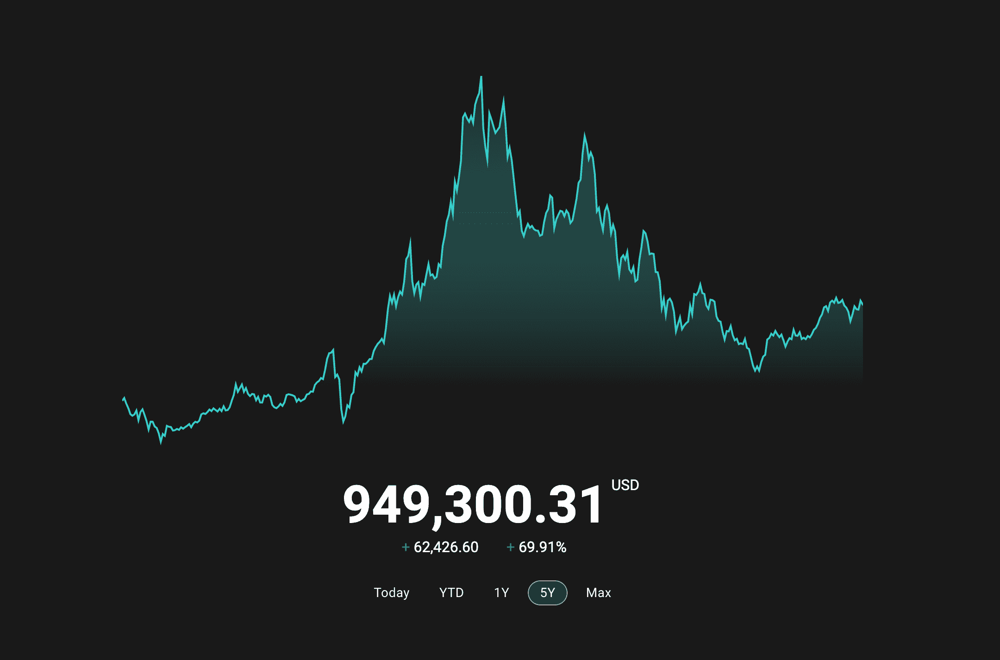

# ghostfolio 👻

[](https://github.com/GrantBirki/ghostfolio/actions/workflows/deploy.yml) [](https://github.com/GrantBirki/ghostfolio/actions/workflows/unlock-on-merge.yml) [](https://github.com/GrantBirki/ghostfolio/actions/workflows/terraform.yml)

A self-hosted version of [ghostfolio](https://github.com/ghostfolio/ghostfolio), deployed in Azure



> This image is just an example

## About ⭐

This project is made for easy self-hosting and deployment of your own ghostfolio instance. It is designed to be deployed on a VM in Azure, but can be deployed anywhere that Docker (docker-compose) is supported. This project comes bundled with the following:

- [Terraform Configurations](./terraform) to help you get up and running with a standard VM in Azure
- [Docker Compose](./docker-compose.yml) to run ghostfolio and its dependencies
- [Caddy](./src/caddy) to automatically generate SSL certificates for your domain
- [Branch Deploy workflow](./.github/workflows/branch-deploy.yml) to help you ship changes to production (on your VM)

## Getting Started 🚀

Once you have a VM setup, SSH onto it and ensure you have a `.env` file (sourced from `.env.example`) in the root of the project.

This project uses the [`ingress`](https://github.com/grantbirki/ingress) project to route traffic into this docker compose stack.

## Updating ghostfolio 🔄

Once your project is fully setup, you will likely want to apply updates from the upstream repository of ghostfolio. To do this, either wait for Dependabot to open a PR or open one yourself.

You can comment `.deploy` on the pull request to branch-deploy and test out the update before fully "committing" to the change and merging the branch into `main`

## Importing Data 📈

When you first start up your ghostfolio instance, you will have no data at all. You'll likely want to import data from your brokerage accounts to get started. This repo comes with a script to help you do that. This script makes a "best effort" attempt to format the `.csv` data from your brokerage into a format that ghostfolio can import. It is not perfect, but it should get you most of the way there.

The script is run like this:

```bash
script/format <path_to_csv> <account_id>
```

Here is an example:

```bash
script/format ~/Downloads/robinhood.csv abc123ab-ab01-ab01-ab01-abc123abc123
```

CLI args:

- `<path_to_csv>` - The path to the `.csv` file you want to format
- `<account_id>` - The ID of the account you want to import the data into - You can find your [account_id here](https://github-production-user-asset-6210df.s3.amazonaws.com/23362539/269414808-bbf74937-d7f6-4dcd-af87-049bee2e29b9.png)

### Supported Brokers

- [Fidelity](./docs/imports/fidelity.md)
- [Schwab](./docs/imports/schwab.md)
- [Robinhood](./docs/imports/robinhood.md)
- [Wex](./docs/imports/wex.md)

> Note: You might need to do some refining of your data before or after running the `script/format` script in order for it to be imported correctly
