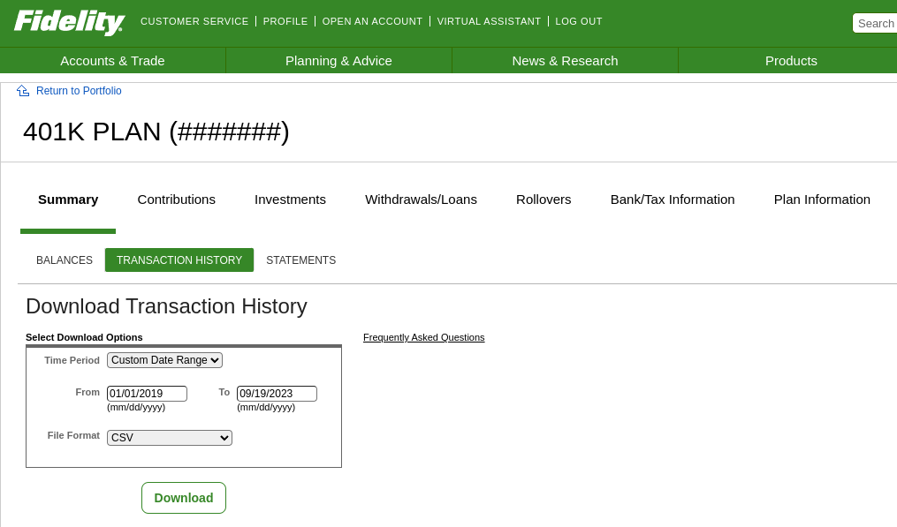

# Fidelity

Go to the following page to pull down a CSV of your transactions:

1. view statements
2. transaction history



You should get some data in a CSV like this:

```csv
Date,Investment,Transaction Type,Amount,Shares/Unit
09/15/2023,VAN IS S&amp;P500 IDX TR,Contributions,"194.10","1.121"
09/15/2023,SMID CAP VALUE ACCT,Contributions,"27.73","2.818"
09/15/2023,FID GR CO POOL CL O,Contributions,"55.46","1.181"
08/31/2023,VAN IS S&amp;P500 IDX TR,Transfers,"0.00","0.000"
```

> The file will probably be named `history.csv`

Set the env var `FIDELITY=true` before running the following script

Now you can parse it with `FIDELITY=true script/format <path_to_csv> <account_id>`

## Notes

- Make sure all the `lib/historical_data` files are up to date from Yahoo finance
- Make sure extra data that isn't csv data is stripped from the file that Fidelity gives you
