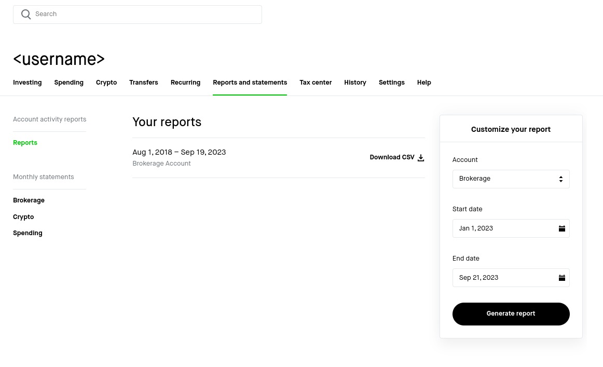

# Robinhood

Go to the following page to pull down a CSV of your transactions: [robinhood.com/account/reports-statements/activity-reports](https://robinhood.com/account/reports-statements/activity-reports)



It may take a while for this CSV to generate.

You should get some data in a CSV like this:

```csv
"Activity Date","Process Date","Settle Date","Instrument","Description","Trans Code","Quantity","Price","Amount"
"9/18/2023","9/18/2023","9/20/2023","O","Realty Income
CUSIP: 756109104
Dividend Reinvestment","Buy","0.810399","$53.85","($43.64)"
"9/15/2023","9/15/2023","9/15/2023","O","Cash Div: R/D 2023-09-01 P/D 2023-09-15 - 170.816188 shares at 0.2555","CDIV","","","$43.64"
"9/15/2023","9/15/2023","9/19/2023","MSFT","Microsoft
CUSIP: 594918104
Dividend Reinvestment","Buy","0.060732","$333.76","($20.27)"
"9/14/2023","9/14/2023","9/14/2023","MSFT","Cash Div: R/D 2023-08-17 P/D 2023-09-14 - 29.813147 shares at 0.68","CDIV","","","$20.27"
"8/18/2023","8/18/2023","8/22/2023","AAPL","Apple
```

Now you can parse it with `script/format <path_to_csv> <account_id>`
