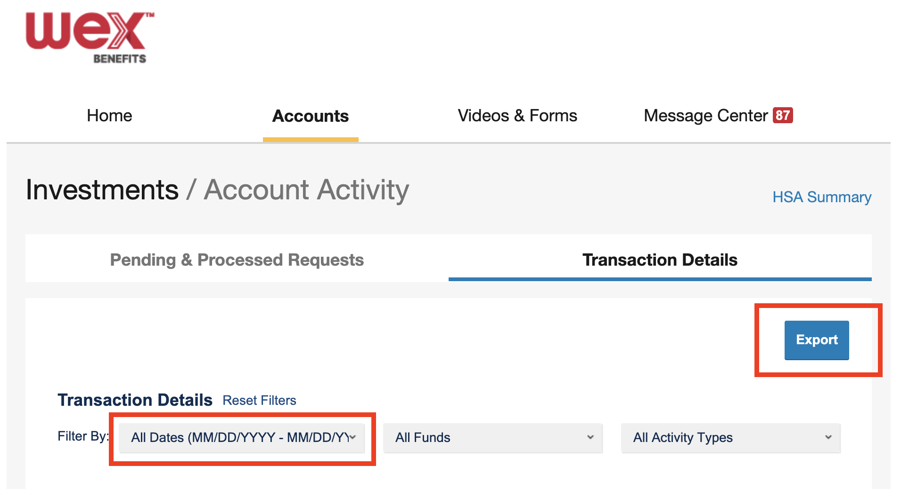

# Wex

Login in your Wex account and go to the Accounts tab. Create an export of all your transactions from the start of time



You should get some data in a CSV like this (`UserExport.csv`):

```csv
Date,FundName,TransName,Units,Amount,Price,Source
09/08/21,AMERICAN FUNDS BALANCED FND R6,Investment Purchase,31.110000,1043.440000,33.540000,
09/08/21,Cash,Investment Purchase - Cash receipt,0.000000,1043.440000,1.000000,
```

Now you can parse it with `script/format <path_to_csv> <account_id>`
